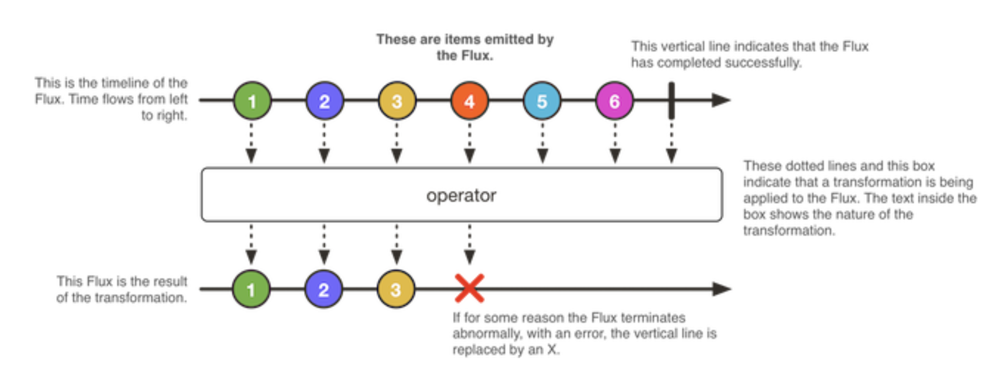
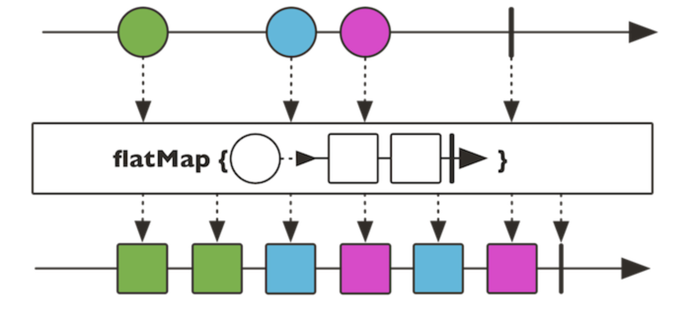

Spring-WebFlux
---

# Project Reactor

Reactor is a fourth-generation Reactive library for building non-blocking applications on the JVM based on the Reactive Streams Specification. Reactor is a fully non-blocking foundation with efficient demand management. It directly interacts with Java 8 functional API, Completable Future, Stream and Duration.

Reactor 3 aims at offering an higher level API that can be leverage in a large breadth of situations, building it on top of Reactive Streams Publisher.

The Spring Framework uses Reactor internally for its own reactive support. Reactor is a Reactive Streams implementation that further extends the basic Reactive Streams Publisher contract with the `Flux` and `Mono` composable API types to provide declarative operations on data sequences of `0..N` and `0..1`.

## Interactions

In reactive stream sequences, the source `Publisher` produces data. But by default, it does nothing until a `Subscriber` has registered (subscribed), at which point it will push data to it.


Reactor adds the concept of **operators**, which are chained together to describe what processing to apply at each stage to the data. Applying an operator returns a new intermediate `Publisher` (in fact it can be though of as both a `Subscriber` to the operator upstream and a `Publisher` for downstream). The final form of the data ends up in the final `Subscriber` that defines what to do from a user perspective.

---

## Flux

A `Flux<T>` is a Reactive Streams `Publisher`, augmented with a lot of operators that can be used to generate, transform, orchestrate Flux sequences.

It can emit 0 to *n* `<T>` elements (`onNext` event) then either completes or errors (`onComplete` and `onError` terminal events). If no terminal event is triggered, the `Flux` is infinite.

- Static factories on Flux allow to create sources, or generate them from several callbacks types.

- Instance methods, the operators, let you build an asynchronous processing pipeline that will produce an asynchronous sequence.

- Each `Flux#subscribe()` or multicasting operation such as `Flux#publish` and `Flux#publishNext` will materialize a dedicated instance of the pipeline and trigger the data flow inside it.



`Flux` in action:

```java

Flux.fromIterable(getSomeLongList())
    .delayElements(Duration.ofMillis(100))
    .doOnNext(serviceA::someObserver)
    .map(d -> d * 2)
    .take(3)
    .onErrorResumeWith(errorHandler::fallback)
    .doAfterTerminate(serviceM::incrementTerminate)
    .subscribe(System.out::println);

```

---

## Mono

A `Mono<T>` is a Reactive Streams `Publisher`, also augmented with a lot of operators that can be used to generate, transform, orchestrate Mono sequences.

It is a specialization of `Flux` that can emit at **most 1 `<T>` element**: a Mono is either valued (complete with element), empty (complete without element) or failed (error).

A `Mono<Void>` can be used in cases where only the completion signal is interesting (the Reactive Streams equivalent of a Runnable task completing).

Like for `Flux`, the operators can be used to define an asynchronous pipeline which will be materialized anew for each `Subscription`.

Note that some API that change the sequence's cardinality will return a `Flux` (and vice-versa, APIs that reduce the cardinality to 1 in a `Flux` return a `Mono`).


`Mono` in action:

```java

Mono.just(1)
    .map(integer -> "foo" + integer)
    .or(Mono.delay(Duration.ofMillis(100)))
    .subscribe(System.out::println);
```

---

## StepVerifier

This class from the `reactor-test` artifact is capable of subscribing to any `Publisher` (eg. a `Flux` or an Akka Stream...) and then assert a set of user-defined expectations with regard to the sequence.

If any event is triggered that doesn't match the current expectation, the `StepVerifier` will produce an `AssertionError`.

You can obtain an instance of `StepVerifier` from the static factory `create`. It offers a DSL to set up expectations on the data part and finish with a single terminal expectation (completion, error, cancellation...).

Note that **you must always call the `verify()` method** or one of the shortcuts that combine the terminal expectation and verify, like `.verifyErrorMessage(String)`. Otherwise the `StepVerifier` won't subscribe to your sequence and nothing will be asserted.

```java

StepVerifier.create(T<Publisher>).{expectations...}.verify()

```

> Remember the `verify()` step, which triggers the verification. In order to help, the API includes a few shortcut methods that combine the terminal expectations with a call to `verify()`: `verifyComplete()`, `verifyError()`, `verifyErrorMessage(String)`, and others.

> By default, the `verify()` method and derived shortcut methods (`verifyThenAssertThat`, `verifyComplete()`, etc.) has no timeout. It can block indefinitely. You can use `StepVerifier.setDefaultTimeout(Duration)` to globally set a timeout for these methods, or specify one on a per-call basis with `verify(Duration)`.
 
---

## Transforming the data

Reactor ships with several operators that can be used to transform data.

**map** method is used to yransform the items emitted by `Mono` or `Flux` by applying a synchronous function to each item.

```java

// Capitalize the user username, firstname and lastname
    Mono<User> capitalizeOne(Mono<User> mono) {
	return mono.map(u -> new User(u.getUsername().toUpperCase(), u.getFirstname().toUpperCase(),
		u.getLastname().toUpperCase()));
    }

    // TODO Capitalize the users username, firstName and lastName
    Flux<User> capitalizeMany(Flux<User> flux) {
	return flux.map(u ->
		new User(u.getUsername().toUpperCase(), 
			 u.getFirstname().toUpperCase(),
			 u.getLastname().toUpperCase()));
    }
```  

**`flatMap`** takes a transformation `Function` that returns a `Publisher<U>` instead of a `U`. This publisher represents the asynchronous transformation to apply to each element. If we were using it with `map`, we'd obtain a stream of `Flux<Publisher<U>>`. Not very useful.

But `flatMap` on the other hand knows how to deal with these inner publishers: it will subscribe to them then merge all of them into a single global output, a much more useful `Flux<U>`. Note that if values from inner publishers arrive at different times, they can interleave in the resulting `Flux`.



---

## Merge

Merging sequences is the operation consisting of listening for values from several `Publisher`s and emitting them in a single `Flux`.

```java
 	// Merge flux1 and flux2 values with interleave
    Flux<User> mergeFluxWithInterleave(Flux<User> flux1, Flux<User> flux2) {
	return flux1.mergeWith(flux2);
    }

    // Merge flux1 and flux2 values with no interleave (flux1 values and then flux2 values)
    Flux<User> mergeFluxWithNoInterleave(Flux<User> flux1, Flux<User> flux2) {
	return flux1.concatWith(flux2);
    }

    // Create a Flux containing the value of mono1 then the value of mono2
    Flux<User> createFluxFromMultipleMono(Mono<User> mono1, Mono<User> mono2) {
	return Flux.concat(mono1, mono2);
    }
```    

## Request & Backpressure

Backpressure is a feedback mechanism that allows a `Subscriber` to signal to its `Publisher` how much data it is prepared to process, limiting the rate at which the `Publisher` produces data.

This control of the demand is done at the `Subscription` level: a `Subscription` is created for each `subscribe()` call and it can be manipulated to either `cancel()` the flow of data or tune demand with `request(long)`.

Making a `request(Long.MAX_VALUE)` means an **unbounded demand**, so the Publisher will emit data at its fastest pace.


 


https://tech.io/playgrounds/929/reactive-programming-with-reactor-3/Error


---

# Spring WebFlux

There are two ways to use Spring Webflux. One using annotations, which is quite similar to Spring MVC, and one using a functional way.


